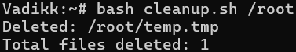
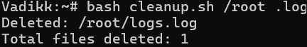
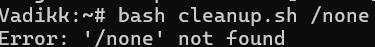
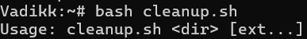

# This script is cleaning up temporary files

1. The script take at least one argument: the path to the directory to clean up;
2. The remaining arguments are optional and specify the types of files to delete (e.g., .tmp, .log);
3. By default, files with the .tmp extension are deleted;
4. At the end of the script execution, it output the number of deleted files.

## Script behavior scenarios

### Working scenarios
`bash cleanup.sh /tmp`  
- Clear the tmp folder by default

`bash cleanup.sh /tmp .tmp .log`  
- Choose the required extensions

### Non-working scenarios

`bash cleanup.sh`  
- Wrong usage, no required parameters.

`bash cleanup.sh /none`  
- No such a directory.

