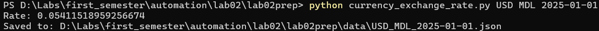
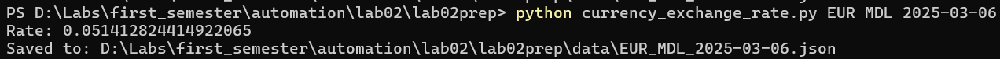
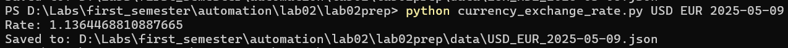
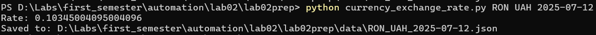
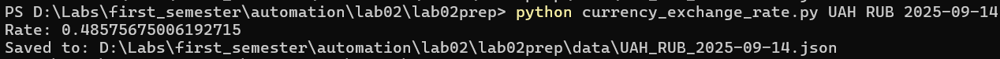
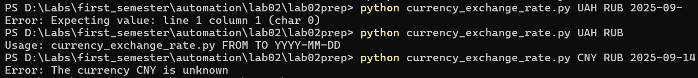
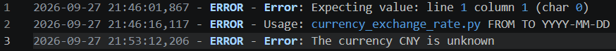

# Currency Exchange Rate

Python script for getting the exchange rate between two currencies for a specified date using the currency exchange service API.

## Requirements

* Python 3.x
* Docker
* Running currency exchange API service on `http://localhost:8080/`
* Python package `requests`

### Install Python dependencies

Install the required package with:

```bash
pip install requests
```

If you use a virtual environment, activate it before installing the package.

### Start the API service

Before running the Python script, the currency exchange service must be running in a Docker container.

Start the application from its project directory with:

```bash
docker compose up --build
```

The API should then be available at:

```text
http://localhost:8080/
```

## How to Run

After starting the Docker container, run the script:

```bash
python currency_exchange_rate.py FROM TO YYYY-MM-DD
```

For example:

```bash
python currency_exchange_rate.py USD EUR 2025-01-01
```

The script accepts three command-line parameters:

* `FROM` — currency to convert from
* `TO` — currency to convert to
* `YYYY-MM-DD` — date for which the exchange rate is requested

### Running from another directory

The script can also be executed using its absolute path, so it does not have to be run from the project directory.

For example:

```bash
python "C:\path\to\currency_exchange_rate.py" USD EUR 2025-01-01
```

The script uses its own location as the project root, so the `data` directory and `error.log` are created next to the script even when it is launched from another directory or repository.

After a successful request, the result is saved as a JSON file in the `data` directory.

The filename contains the currencies and the requested date, for example:

```text
data/USD_EUR_2025-01-01.json
```

Errors are displayed in the console and saved to:

```text
error.log
```

## Script Structure

The script consists of the following main parts:

* **Configuration** — defines the API URL, API key, project root directory and logging settings.
* **`fail()`** — displays an error message in the console and writes it to `error.log`.
* **`main()`** — contains the main program logic:

  1. Checks the number of command-line arguments.
  2. Reads the currencies and date from the command line.
  3. Sends a POST request to the API using `requests`.
  4. Checks the API response and handles errors.
  5. Creates the `data` directory if it does not exist.
  6. Saves the received data as a JSON file.
  7. Displays the exchange rate and path to the saved file.

The script starts execution through:

```python
if __name__ == "__main__":
    main()
```

## Working scenarios

```bash
python currency_exchange_rate.py USD MDL 2025-01-01
```



```bash
python currency_exchange_rate.py EUR MDL 2025-03-06
```



```bash
python currency_exchange_rate.py USD EUR 2025-05-09
```



```bash
python currency_exchange_rate.py RON UAH 2025-07-12
```



```bash
python currency_exchange_rate.py UAH RUB 2025-09-14
```



## Non-working scenrios

**Console messages**



**`error.log` messages**

